# Git学习笔记

### 				——基于极客时间

[toc]

## 1 基本篇

### 1.1 综述

git是个版本控制系统，文件管理工具；

版本控制系统的历史：

- 从无到有，手动拷贝；
- 集中式；svn；客户端必须时刻与服务端相连接
- 分布式；服务端和客户端都有完整的版本库，所以版本管理效率更高；

git诞生的原因，是Linux老师一直使用的版本控制系统，不再免费使用了，所以林老师就决定自己写一个来自己用。所以git也是一个非常牛逼的文件管理工具；

优点

- 最优的存储性能
- 非凡的性能
- 开源
- 容易做备份
- 容易定制工作流程
- 支持离线操作

优点多，用的人也多。

基于git，诞生了github和gitlab等

### 1.2 安装

我用的mac，所以就关注mac了。

Windows上面都是直接使用的git bash集成工具来的。

mac上面，现在知道的有三种方式

- 按照视频所述直接下载安装包
- 安装git官网对mac系统的提示安装，通过brew
- m1系列的Mac，好像是都自带了Git的

验证安装成功，就输入git --version，查看安装的版本即可；

如果是Apple自带的，会显示版本和Apple Git字样的；

### 1.3 使用Git之前需要做的最小配置

- user.name和user.email的配置——要保留每次变更的操作人信息
- 范围，global，local（默认）

### 1.4 本地建仓并设置local用户信息

```
git init project_name
```

在目录下配置local的用户信息

注意：local和global都对当前目录生效的时候，local优先级更高

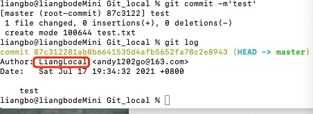

### 1.5 工作区和暂存区

### 1.6 给文件重命名

```
git mv old_file new_file
```

### 1.7 git log查看版本演变历史

### 1.8 gitk 通过图形界面来查看版本历史

所以各种工具中集成的图形化的git，是不是都是基于这个来的？嗯，感觉是基于git log来的，后面有几乎可以验证下。

注意作者和提交人是不一定同一个的。因为提交人可能是对其他人的提交进行处理的。版权严谨。

### 1.9 .git目录

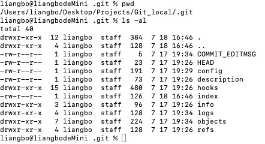

实现本地管理能力
ls -al
HEAD 文件，是个引用，指向当前分支
config 文件，存储了配置信息，比如之前配置的密码啥的
refs文件夹 有heads(分支)和tags(里程碑)，存的是每次commit。通过git cat-file -t来看文件属性。关于hash值，能区分开的时候，git会截断展示
objects tree类型 git cat-file -p 看内容 存储blob
git的核心对象是commit tree blob
实践证明，add到暂存区，就会在objects中创建文件了


下图展示了HEAD和refs文件夹的关系；HEAD指向refs/head的当前分支/commit（通过类型可以看出是commit类型）

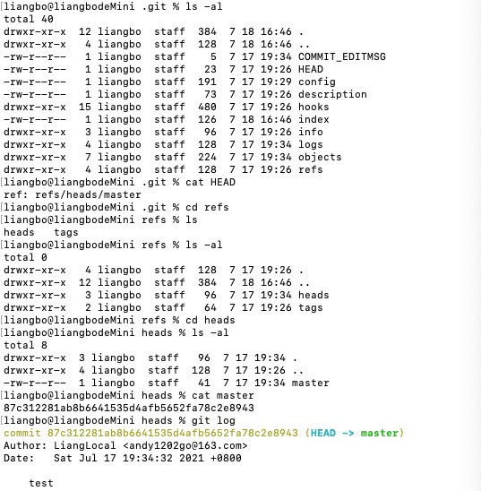


config文件保存了当前仓库的配置信息

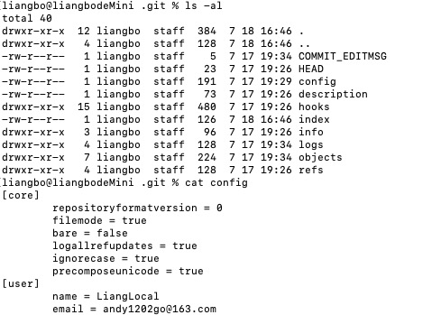

还有一个很重要的文件夹是objects;

进去看到的object是内部的文件名和外部的短的文件夹名称一起组成的objectName，这点需要注意

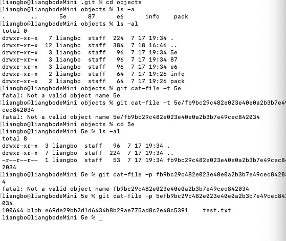

对于object来说，有commit、tree、blob几种；是git的核心对象

在objects文件夹中，如果之前commit有文件夹，则有的object就是tree，tree中的内容就是文件夹中的内容；而各种实际的文件，都是在叶子节点上的，且是blob类型；

设计成这样子，考虑的话，感觉一方面易于管理文件，一方面对于相同的内容（注意是内容），其blob都是一样的（节省空间啥的）

### 1.10 commit tree blob的关系


commit中存储当前提交的各种信息，数据则存储为一棵树

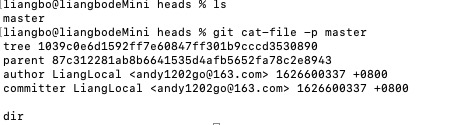

树和blob上面聊过了，图示也比较清晰了

### 1.12 分离头指针

git checkout 某个commitId的时候，会出现

理论上在尝试修改的情况下，可以这么玩；

所谓分离头指针，是指HEAD不是指向某个分支，而是直接指向某个commit了；这个可以通过不同情况下的git log来验证（HEAD -> master和HEAD）；此时的变更没有基于某个branch去做

在分离头指针的情况下，也可以提交commit啥的，但是实际上不会出现在历史树上；如果在切换分支前没有把这个commit跟某个分支或tag绑定，则git会认为这种commit是不重要的；

### 1.13 进一步理解HEAD和branch

不管HEAD指向branch还是commit，最后都是指向某个commit；

所以是头**指针**

在很多命令的时候，都可以直接用HEAD替代

## 2 独自使用Git时的常见场景

### 2.14 怎么删除不需要的分支

```
git branch -d
git branch -D
```

### 2.15 修改最新的commit的message

```
git commit --amend
```

### 2.16 修改历史的信息

```
git rebase -i commitID
```

Rebase命令，-i表示交互界面，在交互界面可以做许多事情，通过下面的注释来进行选择了；比如reward就是修改message的，所以对于需要修改的commit，修改为reward，然后再进行交互即可；

> 目前这里使用这个，去修改历史commit的message
> git rebase -i commitId
> 弹出交互页面，根据命令提示，使用reward
> 实际实现，从最后git的响应来看，是分离头指针后，执行命令后，重新提交了，blob是没有变化的
> 对于本地可以这么玩

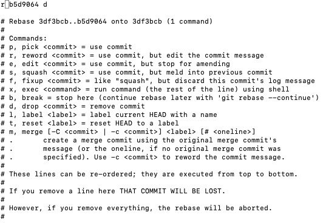

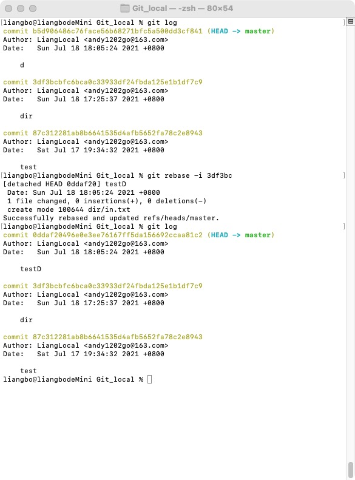

### 2.17 合并连续commit

还是用rebase，只是这次使用squash命令

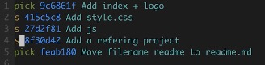

### 2.18 合并不连续commit

还是rebase，只要自己认为不冲突，就可以调整commit的前后顺序；

### 2.19 比较暂存区和HEAD

```
git diff --cached
```

### 2.20 比较工作区和暂存区

```
git diff
或
git diff -- 文件1 文件2 文件3 ...
```

### 2.21 如何让暂存区恢复成和HEAD的一样

```
git reset HEAD
```

用于暂存区的东西都不想要了，想把这些变更都先回退到工作区的情况下；

理论上，reset命令是比较危险的感觉，因为了解到reset的原理是异动git的HEAD指针，相当于会把commit给删除掉了；

同样的re-操作，还有restore和revert；

restore，在git status等情况下经常被提醒，该命令是“撤销”的含义，就是把文件从缓存区撤销，回到未被追踪的状态（untracked）；https://www.cnblogs.com/teach/p/13997323.html

这里就要提到git文件的几种状态了

https://blog.csdn.net/gsls181711/article/details/45149635

git revert和git reset都是恢复之前版本的方法，只不过原理不同，reset是重新指定HEAD的指向，指向旧的commit，删除一些commit；revert是创建一个新的commit，复制自指定的旧的commit；https://www.jb51.net/article/192271.htm


### 2.22 工作区恢复为暂存区

```
git checkout -- <file>...
```

一个原则是，想动工作区的内容，使用git checkout，动暂存区的，使用git reset；

但这种命令用不好，有可能找不回来文件，导致这些命令有点“危险”

### 2.23 取消部分暂存区文件的更改

```
git reset HEAD <file>...
```

### 2.24 消除最近几次提交

不打算这么做...即使是一个人使用的情况下

```
git reset --hard
```

慎用，危险！

### 2.25 比较不同提交的异同

```
git diff commit1 commit2
git diff temp master
```

比较分支也是一样的，不同的分支，其实就是头指针指向的commit不同罢了

### 2.26 正确删除文件的方法

```
git rm
```

否则使用linux命令rm，git 中还需要使用git rm <file>执行一遍.

注意，这里是说正确的删除git文件的方法，不是新加入到某个文件夹下的文件的方法

### 2.27 开发中紧急加塞任务时

```
git stash
```

讲道理没有使用过这个命令；因为一般遇到这种场景，我宁愿是在本地commit一下，不push到远端；然后另外一个文件夹去clone代码，拉新分支搞一下的；

这个命令出现的情况，或者说理由，也是充分的，毕竟当前有变动的时候，是不好checkout其他分支做修改啥的，git的保护还是很充分的；有机会的话，可以试试这个命令；https://zhuanlan.zhihu.com/p/94216223

### 2.28 如何指定不需要git管理的文件

.gitignore

写法就是通配符，找到某种文件类型；/ 表示文件夹

### 2.29 git的备份

说到备份，离不开传输协议；git的备份有智能协议和哑协议之分；

哑协议传输进度不可见，智能协议可见且速度更快；

常用的智能协议是http,https,ssh

Git fetch 下来

## 3 Git与GitHub的简单同步

### 3.30 注册GitHub账号

### 3.31 配置公私钥

因为需要通过ssh连接Git使用，所以需要这个东西；

``` 
ls -al ~/.ssh
```

通过这个命令先看下有没有rsa文件，即是否生成过秘钥了；

然后可以通过

```
ssh-keygen -t rsa -C "email-address"
```

来生成秘钥；

将.pub文件内容复制在git网站-设置-ssh-新建ssh中即可完成设置；

当然以上步骤其实通过官方帮助文档来的更靠谱；

官方help文档，在git网站-头像-Help中，切换简体中文，美滋滋。

### 3.32 在GitHub上创建个人仓库

强烈建议创建仓库的时候顺带创建README文件，因为搜索仓库的时候，会在README文件搜索关键字。

注意License的运用，对于以后的引用输出的时候，这块需要谨慎，有些license是不允许引用啥的的。

### 3.33 把本地仓库同步到GitHub

git remote -v
git remote add branch sshURL
这种情况是属于，本地有建立库和分支啥的
git pull相当于先做了git fetch然后又做了git merge的
fast-forward似乎是要有共同的祖先的git branch -av
recursive strategy
git push c

## 4 Git多人单分支集成协作时的常见场景

### 4.34 不同的人修改了不同文件如何处理

没有冲突，自己提自己的就好了

所以养成习惯，commit以后，如果想push到远端，先pull下来看看，再合并后进行push

### 4.35 不同人修改了同文件的不同区域如何处理

没有冲突，智能的git会合并这些，自己提自己的即可

### 4.36 不同人修改了同文件的同一区域

有冲突，需要人工解决；

这种情况git不能处理，需要人工介入
<HEAD到=是远端的，下面的是自己本地的

### 4.37 同时变更了文件名和文件内容如何处理？

智能的git会处理的，不用担心

### 4.38 把同一文件改成了不同的文件名如何处理

人工介入，保留一个删除一个

## 5 Git集成使用禁忌

### 5.39 禁止向集成分支执行push -f操作

force

-f 如果本地的分支比较老，强制提交的话，会把很多远端的commit清除掉

### 5.40 禁止向集成分支执行变更历史的操作

就是禁止把远端分支拉到本地后进行rebase

## 6 初识GitHub

### 6.41 GitHub为什么会火

Git只是解决了开发人员之间的协作的问题，但是对于开源软件，缺少一个分享、传播的平台。

- 托管整个代码的地方
- 程序员可以协同工作
- 了解如何充分利用Git

### 6.42 GitHub有哪些核心功能

通过GitHub首页最下面的features介绍（https://github.com/features）可以找到

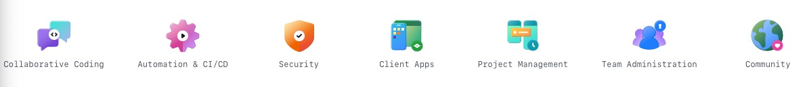

- 协作编程——依托于Git，强大

- 自动化及持续集成和持续部署——有各种第三方能力_marketplace

- 安全

- 提供客户端应用程序

- 项目管理——精简，灵活性高，功能并不完备

- 团队管理——organization

- 社区

### 6.43 怎么快速找到感兴趣的开源项目

即怎么使用好GitHub的搜索功能；

支持精确搜索；

一方面可以找到advanced search按钮，使用图形界面的高级搜索功能；

另一方面可以在搜索框输入特定，比如

- 多个关键字：git 学习资料 最好；会搜索仓库名，仓库的介绍，仓库的readme文件内容；
- 在readme中搜索关键字：关键字 in:readme
- 在readme中搜索关键字，且star数大于10000：git 最好 学习 资料 in:readme stars:>10000
- 搜索某一特定代码：filename:shithappens；注意搜代码和搜仓库不能并行；

更多使用参考官方文档：https://docs.github.com/en/github/searching-for-information-on-github/searching-on-github/searching-wikis

推荐：

- ruanyf/weekly

### 6.44 怎样在GitHub上搭建个人博客

直接搜索 

```
blog easily start in:readme stars:>5000
```

Jekyll 就是第一个了，只需几步完成搭建

1. fork：fork就是远端的clone了，clone到你的那边去
2. 到你自己的账户中，找到jekyll仓库，进入settings，修改仓库名称为你的博客名称.github.io
3. 修改_config.yml文件，各种博客相关的配置都在这里；
4. 进入code，_posts文件夹，上传md文件，注意文件名命名格式规范：2021-07-31-标题.md
5. 进入设置-pages，进行配置，然后访问链接

额，有点老了，应该是没有更新过了，然后GitHub本身有更新变化，这个不符合GitHub站点发布规则了，整体有问题；

重新尝试之后，找到一个简单的（因为懒得自己去搞了，先搞定使用GitHub提供的静态网站的能力吧）

```
GitHub hosted blogs in:readme created:>2020
```

在第2页找到[svelteland/svelte-kit-blog-demo](https://github.com/svelteland/svelte-kit-blog-demo)，点进去看了下，各方面都可用，满足我的要求；

按照之前的经验，fork过去，调整一些东西之后，就可以使用了，docs文件夹放东西即可


但好像还是有问题，即使是fork过来，page配置之后，都是不行的，算了，还是第一个吧，虽然丑了点，但先能用着再说，反正现在也没写啥东西。

### 6.45 开源项目怎么保证代码质量

指定特定的组或人可以进行代码commit；

其他的可以pull request；

同时辅助以CI，自动化的检查等

### 6.46 为何需要组织类型的仓库

## 7 使用GitHub进行团队协作

### 7.47 创建团队的项目

创建repository的时候，选择Owner即可，选择对应的org；

然后再settings中选择team等，赋予权限

### 7.48 怎样选择适合自己团队的工作流

- 主干开发：在一条主干上进行开发；适用于设计和开发能力强的，保证上线后无需修改代码就能够修改系统行为；适用于能力强，人员少，用户升级组件成本低的环境；
- Git Flow：切换来切换去的，图很复杂的那种；有预定的发布周期，不适合敏捷开发，需要执行严格的发布流程；
- GitHub Flow：从主干拉特性分支出去开发，开发完合回去；发布集成等较快；
- Gitlab Flow：master分支和production分支，master持续集成，production上线；也可以增加pre-production分支；

### 7.49 如何挑选合适的分支集成策略

settings中的merge button

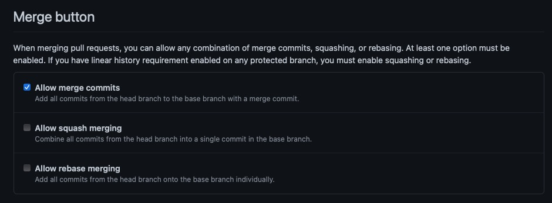

看了下，还是只能commit吧，虽然最后出来的图很奇怪，但是习惯了。可能也是因为工作流的原因；

squash和rebase的类似于主干的感觉，然后大团队强调规范流程，严格执行等

### 7.50 启用issue跟踪需求和任务

GitHub的issue没有用状态图什么的，使用的是label

默认的仓库里面应该是开启的；

create issue，然后基于issue可以进行探讨；

issue本身是开启或关闭的状态；

issue可以被label，标记为各种东西；

也可以为快速的创建对应的issue的模板；

所以，查看其他仓库的时候，可以看下issue多不多，是不是有很多未关闭的啥的，来判定项目的进展情况。

### 7.51 如何用project管理issue

就是使用project功能的看板来管理issue和pull request

在repo的projects创建一个新的即可开始

### 7.52 项目内部怎么做code review

settings-branches 添加protection rule，apply rule to master

所以pull request的**强制**限制，其实就是这里来的

### 7.53 团队协作时如何做多分支的集成

merge比rebase好用，体现在团队协作的时候，会把多个commit合并到master分支去用

主要是实践下，关注冲突的解决

### 7.54 怎么保证集成的质量

使用market的app去控制，比如TravisCI，比如Codecov控制代码覆盖率等等。

还有之前提到的push的强制pull request的控制。

### 7.55 怎样把产品包发布到GitHub上

releases栏目，使用安装的app进行处理

看了下，截止21年，好像已经是action栏目了；

错了，releases还是有的，在侧边栏

### 7.56 给项目增加详细的指导文档

wiki栏目

小技巧，找到自己觉得写得还不错的wiki的仓库，clone到本地，然后push到我们自己的仓库中来，然后就可以基于此进行编辑了

## 8 Gitlab实践

### 8.57 gitlab为啥受国内互联网企业欢迎

- 开源，可自行搭建；

- 社区活跃
- 更新块
- CI发展快

### 8.58 gitlab的核心功能

全生命周期，devops

### 8.59 gitlab上做项目管理

issues和merge request

### 8.60 gitlab上怎么做code review

类似GitHub；

另外还有gitlab robot可以自动化搞——这个可以尝试下

### 8.61 gitlab上怎么保证集成质量

### 8.62 怎么把应用部署到AWS上面

## 其他独立问题

### 1 git命令中，有选项，选项中，什么时候用-，什么时候用--？

- 参考知乎问题https://www.zhihu.com/question/41366215
- 总结一下
  - 通常，-简写，--全拼
  - 风格问题/历史原因，UNIX，GNU等习惯不同而延续下来的


