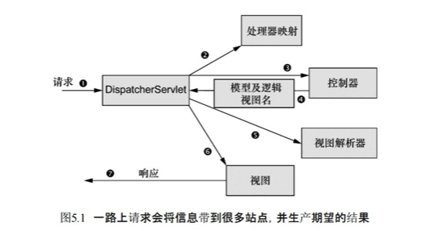

# Spring入门

[toc]

## Spring实战（第4版）

有核心原理的介绍，比较适合入门。

- 目的：简化JavaEE的开发
- 路线图：Spring核心，SpringWeb，Spring持久化

### 第1部分　Spring的核心

#### 第1章　Spring之旅　3

##### 1.1　简化Java开发　4

###### 1.1.1　激发POJO的潜能　5

1.1.2　依赖注入　5
1.1.3　应用切面　11
1.1.4　使用模板消除样板式代码　16
1.2　容纳你的Bean　18
1.2.1　使用应用上下文　19
1.2.2　bean的生命周期　20
1.3　俯瞰Spring风景线　21
1.3.1　Spring模块　22
1.3.2　Spring Portfolio　24
1.4　Spring的新功能　27
1.4.1　Spring 3.1新特性　27
1.4.2　Spring 3.2新特性　28
1.4.3　Spring 4.0新特性　30
1.5　小结　30
第2章　装配Bean　33
2.1　Spring配置的可选方案　34
2.2　自动化装配bean　35
2.2.1　创建可被发现的bean　35
2.2.2　为组件扫描的bean命名　38
2.2.3　设置组件扫描的基础包　39
2.2.4　通过为bean添加注解实现自动装配　40
2.2.5　验证自动装配　42
2.3　通过Java代码装配
bean　44
2.3.1　创建配置类　44
2.3.2　声明简单的bean　45
2.3.3　借助JavaConfig实现注入　46
2.4　通过XML装配bean　48
2.4.1　创建XML配置规范　48
2.4.2　声明一个简单的
[bean]　49
2.4.3　借助构造器注入初始化bean　50
2.4.4　设置属性　56
2.5　导入和混合配置　61
2.5.1　在JavaConfig中引用XML配置　61
2.5.2　在XML配置中引用JavaConfig　63
2.6　小结　65
第3章　高级装配　67
3.1　环境与profile　67
3.1.1　配置profile bean　69
3.1.2　激活profile　73
3.2　条件化的bean　75
3.3　处理自动装配的歧义性　78
3.3.1　标示首选的bean　79
3.3.2　限定自动装配的bean　80
3.4　bean的作用域　84
3.4.1　使用会话和请求作用域　86
3.4.2　在XML中声明作用域代理　88
3.5　运行时值注入　88
3.5.1　注入外部的值　89
3.5.2　使用Spring表达式语言进行装配　93
3.6　小结　99
第4章　面向切面的Spring　101
4.1　什么是面向切面编程？　102
4.1.1　定义AOP术语　103
4.1.2　Spring对AOP的支持　105
4.2　通过切点来选择连接点　107
4.2.1　编写切点　108
4.2.2　在切点中选择bean　109
4.3　使用注解创建切面　109
4.3.1　定义切面　110
4.3.2　创建环绕通知　114
4.3.3　处理通知中的参数　115
4.3.4　通过注解引入新功能　118
4.4　在XML中声明切面　120
4.4.1　声明前置和后置通知　122
4.4.2　声明环绕通知　124
4.4.3　为通知传递参数　125
4.4.4　通过切面引入新的功能　127
4.5　注入AspectJ切面　128
4.5　小结　131

### 第２部分　Web中的Spring

- SpringMVC是构建在Spring理念之上的一个Web框架
- 基础用法
- 渲染视图
- 高级技术：自定义配置，multipart文件上传等
- 工作流

#### 第5章　构建Spring Web应用程序　135

- 针对基于Web的应用程序
- HTTP的无状态性决定了状态管理、工作流、验证等不容易处理
- SpringMVC基于MVC模式

##### 5.1　Spring MVC起步　136

**先定个基调：Spring MVC中的组件都有特定的目的，并且也没有那么复杂！**

###### 5.1.1　跟踪Spring MVC的请求　136

**7部曲**

1. 前端控制器（DispatcherServlet）接收请求
2. 处理器映射（Handler），根据URL决策Controller是哪个
3. 前端控制器把请求发给处理器映射找到的Controller，控制器处理请求
4. 控制器处理后的信息，称为模型（Model）；控制器将模型数据打包，并标示出用于渲染输出的视图名，发回给前端控制器
5. DispatcherServlet使用视图解析器（view resolver）将逻辑视图名匹配为一个特定的视图实现
6. 视图的实现，在这里交付模型数据，完成请求的任务
7. 视图将使用模型数据渲染输出，通过响应对象传递给客户端

5.1.2　搭建Spring MVC　138
5.1.3　Spittr应用简介　142
5.2　编写基本的控制器　143
5.2.1　测试控制器　145
5.2.2　定义类级别的请求处理　146
5.2.3　传递模型数据到视图中　147
5.3　接受请求的输入　153
5.3.1　处理查询参数　153
5.3.2　通过路径参数接受输入　155
5.4　处理表单　157
5.4.1　编写处理表单的控制器　160
5.4.2　校验表单　163
5.5　小结　166

#### 第6章　渲染Web视图　167

6.1　理解视图解析　167
6.2　创建JSP视图　170
6.2.1　配置适用于JSP的视图解析器　170
6.2.2　使用Spring的JSP库　172
6.3　使用Apache Tiles视图定义布局　184
6.3.1　配置Tiles视图解析器　185
6.4　使用Thymeleaf　190
6.4.1　配置Thymeleaf视图解析器　190
6.4.2　定义Thymeleaf模板　192
6.5　小结　196

#### 第7章　Spring MVC的高级技术　197

7.1　Spring MVC配置的替代方案　198
7.1.1　自定义DispatcherServlet配置　198
7.1.2　添加其他的Servlet和Filter　199
7.1.3　在web.xml中声明DispatcherServlet　201
7.2　处理multipart形式的数据　204
7.2.1　配置multipart解析器　205
7.2.2　处理multipart请求　208
7.3　处理异常　212
7.3.1　将异常映射为HTTP状态码　213
7.3.2　编写异常处理的方法　214
7.4　为控制器添加通知　216
7.5　跨重定向请求传递数据　217
7.5.1　通过URL模板进行重定向　218
7.5.2　使用flash属性　219
7.6　小结　221

#### 第8章　使用Spring WebFlow　223

8.1　在Spring中配置Web　Flow　224
8.1.1　装配流程执行器　224
8.1.2　配置流程注册表　224
8.1.3　处理流程请求　225
8.2　流程的组件　226
8.2.1　状态　226
8.2.2　转移　230
8.2.3　流程数据　231
8.3　组合起来：披萨流程　232
8.3.1　定义基本流程　233
8.3.2　收集顾客信息　236
8.3.2　构建订单　242
8.3.2　支付　244
8.4　保护Web流程　246
8.5　小结　246

#### 第9章　保护Web应用　249

9.1　Spring Security简介　250
9.1.1　理解Spring Security的模块　250
9.1.2　过滤Web请求　251
9.1.3　编写简单的安全性配置　252
9.2　选择查询用户详细信息的服务　255
9.2.1使用基于内存的用户存储　255
9.2.2　基于数据库表进行认证　257
9.2.3　基于LDAP进行认证　259
9.2.4　配置自定义的用户服务　263
9.3　拦截请求　265
9.3.1　使用Spring表达式进行安全保护　267
9.3.2　强制通道的安全性　269
9.3.3　防止跨站请求伪造　270
9.4　认证用户　271
9.4.1　添加自定义的登录页　272
9.4.2　启用HTTP Basic认证　274
9.4.3　启用Remember-me功能　274
9.4.4　退出　275
9.5　保护视图　276
9.5.1　使用Spring Security的JSP标签库　276
9.5.2　使用Thymeleaf的SpringSecurity方言　280
9.6　小结　281
第3部分　后端中的Spring
第10章　通过Spring和JDBC征服数据库　285
10.1　Spring的数据访问哲学　286
10.1.1　了解Spring的数据访问异常体系　287
10.1.2　数据访问模板化　289
10.2　配置数据源　291
10.2.1　使用JNDI数据源　292
10.2.2　使用数据源连接池　292
10.2.3　基于JDBC驱动的数据源　294
10.2.4　使用嵌入式的数据源　295
10.2.5　使用profile选择数据源　296
10.3　在Spring中使用
JDBC　298
10.3.1　应对失控的JDBC代码　299
10.3.2　使用JDBC模板　302
10.4　小结　307
第11章　使用对象-关系映射持久化数据　309
11.1　在Spring中集成Hibernate　310
11.1.1　声明Hibernate的Session工厂　311
11.1.2　构建不依赖于Spring的Hibernate代码　313
11.2　Spring与Java持久化API　315
11.2.1　配置实体管理器工厂　315
11.2.2　编写基于JPA的Repository　320
11.3　借助Spring Data实现自动化的JPA　Repository　322
11.3.1　定义查询方法　325
11.3.2　声明自定义查询　328
11.3.3　混合自定义的功能　329
11.4　小结　330
第12章　使用NoSQL数据库　333
12.1　使用MongoDB持久化文档数据　334
12.1.1　启用MongoDB　335
12.1.2　为模型添加注解，实现MongoDB持久化　338
12.1.3　使用MongoTemplate访问MongoDB　341
12.1.4　编写MongoDBRepository　342
12.2　使用Neo4j操作图数据　347
12.2.1　配置Spring DataNeo4j　347
12.2.2　使用注解标注图实体　350
12.2.3　使用Neo4jTemplate　353
12.2.4　创建自动化的Neo4j　Repository　354
12.3　使用Redis操作key-value数据　359
12.3.1　连接到Redis　359
12.3.2　使用RedisTemplate　360
12.3.3　使用key和value的序列化器　364
12.4　小结　365
第13章　缓存数据　367
13.1　启用对缓存的支持　368
13.1.1　配置缓存管理器　369
13.2　为方法添加注解以支持缓存　373
13.2.1　填充缓存　374
13.2.2　移除缓存条目　378
13.3　使用XML声明缓存　379
13.4　小结　383
第14章　保护方法应用　385
14.1　使用注解保护方法　386
14.1.1　使用@Secured注解限制方法调用　386
14.1.2　在Spring Security中使用
JSR-250的@RolesAllowed注解　387
14.2　使用表达式实现方法级别的安全性　388
14.2.1　表述方法访问规则　389
14.2.2　过滤方法的输入和输出　391
14.3　小结　395
第4部分　Spring集成
第15章　使用远程服务　399
15.1　Spring远程调用概览　400
15.2　使用RMI　402
15.2.1　导出RMI服务　403
15.2.2　装配RMI服务　405
15.3　使用Hessian和Burlap发布远程服务　407
15.3.1　使用Hessian和Burlap导出bean的功能　408
15.3.2　访问Hessian/Burlap服务　411
15.4　使用Spring的HttpInvoker　413
15.4.1　将bean导出为HTTP服务　413
15.4.2　通过HTTP访问服务　414
15.5　发布和使用Web服务　416
15.5.1　创建基于Spring的JAX-WS端点　416
15.5.2　在客户端代理JAX-WS服务　419
15.6　小结　421
第16章　使用Spring MVC创建REST API　423
16.1　了解REST　424
16.1.1　REST的基础知识　424
16.1.2　Spring是如何支持REST的　425
16.2　创建第一个REST端点　426
16.2.1　协商资源表述　428
16.2.2　使用HTTP信息转换器　433
16.3　提供资源之外的其他内容　438
16.3.1　发送错误信息到客户端　438
16.3.2　在响应中设置头部信息　443
16.4　编写REST客户端　445
16.4.1　了解RestTemplate的操作　446
16.4.2　GET资源　447
16.4.3　检索资源　448
16.4.4　抽取响应的元数据　449
16.4.5　PUT资源　450
16.4.6　DELETE资源　451
16.4.7　POST资源数据　452
16.4.8　在POST请求中获取响应对象　452
16.4.9　在POST请求后获取资源位置　453
16.4.10　交换资源　454
16.5　小结　456
第17章　Spring消息　457
17.1　异步消息简介　458
17.1.1　发送消息　459
17.1.2　评估异步消息的优点　461
17.2　使用JMS发送消息　463
17.2.1　在Spring中搭建消息代理　463
17.2.2　使用Spring的JMS模板　465
17.2.3　创建消息驱动的POJO　474
17.2.4　使用基于消息的RPC　477
17.3　使用AMQP实现消息功能　479
17.3.1　AMQP简介　480
17.3.2　配置Spring支持AMQP消息　481
17.3.3　使用RabbitTemplate发送消息　484
17.3.4　接收AMQP消息　486
17.4　小结　489
第18章　使用WebSocket和STOMP实现消息功能　491
18.1　使用Spring的低层级WebSocket　API　492
18.2　应对不支持WebSocket的场景　497
18.3　使用STOMP消息　500
18.3.1　启用STOMP消息功能　501
18.3.2　处理来自客户端的STOMP消息　504
18.3.3　发送消息到客户端　507
18.4　为目标用户发送消息　511
18.4.1　在控制器中处理用户的消息　512
18.4.2　为指定用户发送消息　514
18.5　处理消息异常　515
18.6　小结　516
第19章　使用Spring发送Email　517
19.1　配置Spring发送邮件　518
19.1.1　配置邮件发送器　518
19.1.2　装配和使用邮件发送器　520
19.2　构建丰富内容的Email消息　521
19.2.1　添加附件　521
19.2.2　发送富文本内容的Email　522
19.3　使用模板生成Email　524
19.3.1　使用Velocity构建Email消息　524
19.3.2　使用Thymeleaf构建Email消息　526
19.4　小结　528
第20章　使用JMX管理Spring　Bean　529
20.1　将Spring bean导出为MBean　530
20.1.1　通过名称暴露方法　533
20.1.2　使用接口定义MBean的操作和属性　535
20.1.3　使用注解驱动的MBean　536
20.1.4　处理MBean冲突　538
20.2　远程MBean　539
20.2.1　暴露远程MBean　539
20.2.2　访问远程MBean　540
20.2.3　代理MBean　542
20.3　处理通知　543
20.3.1　监听通知　544
20.4　小结　545
第21章　借助Spring Boot简化Spring开发　547
21.1　Spring Boot简介　548
21.1.1　添加Starter依赖　548
21.1.2　自动配置　552
21.1.3　Spring Boot CLI　552
21.1.4　Actuator　553
21.2　使用Spring Boot构建应用　553
21.2.1　处理请求　556
21.2.2　创建视图　558
21.2.3　添加静态内容　560
21.2.4　持久化数据　561
21.2.5　尝试运行　563
21.3　组合使用Groovy与SpringBoot　CLI　566
21.3.1　编写Groovy控制器　566
21.3.2　使用Groovy Repository实现数据持久化　569
21.3.3　运行Spring Boot CLI　570
21.4　通过Actuator获取了解应用内部状况　571
21.5　小结　574

## Spring实战（第5版）

据说比较像官方文档

第1部分 Spring 基础
第 1 章 Spring 起步 3
1.1 什么是Spring 4
1.2 初始化Spring 应用 6
1.2.1 使用Spring Tool Suite
初始化Spring 项目 7
1.2.2 检查Spring 项目的
结构 10
1.3 编写Spring 应用 16
1.3.1 处理Web 请求 16
1.3.2 定义视图 17
1.3.3 测试控制器 18
1.3.4 构建和运行应用 20
1.3.5 了解Spring Boot DevTools 21
1.3.6 回顾一下 23
1.4 俯瞰Spring 风景线 24
1.4.1 Spring 核心框架 24
1.4.2 Spring Boot 25
1.4.3 Spring Data 25
1.4.4 Spring Security 25
1.4.5 Spring Integration 和Spring
Batch 26
1.4.6 Spring Cloud 26
1.5 小结 26
第 2 章 开发Web 应用 27
2.1 展现信息 27
2.1.1 构建领域类 28
2.1.2 创建控制器类 30
2.1.3 设计视图 33
2.2 处理表单提交 37
2.3 校验表单输入 43
2.3.1 声明校验规则 43
2.3.2 在表单绑定的时候执行
校验 45
2.3.3 展现校验错误 46
2.4 使用视图控制器 48
2.5 选择视图模板库 49
2.6 小结 52
第3 章 使用数据 53
3.1 使用JDBC 读取和写入
数据 53
3.1.1 调整领域对象以适应
持久化 55
3.1.2 使用JdbcTemplate 56
3.1.3 定义模式和预加载数据 61
3.1.4 插入数据 63
3.2 使用Spring Data JPA 持久
化数据 72
3.2.1 添加Spring Data JPA 到
项目中 72
3.2.2 将领域对象标注为实体 73
3.2.3 声明JPA repository 76
3.2.4 自定义JPA repository 77
3.3 小结 80
第4 章 保护Spring 81
4.1 启用Spring Security 81
4.2 配置Spring Security 83
4.2.1 基于内存的用户存储 85
4.2.2 基于JDBC 的用户存储 86
4.2.3 以LDAP 作为后端的
用户存储 89
4.2.4 自定义用户认证 92
4.3 保护Web 请求 100
4.3.1 保护请求 100
4.3.2 创建自定义的登录页 103
4.3.3 tui出 105
4.3.4 防止跨站请求伪造 106
4.4 了解用户是谁 107
4.5 小结 109
第5 章 使用配置属性 111
5.1 细粒度的自动配置 112
5.1.1 理解Spring 的环境抽象 112
5.1.2 配置数据源 114
5.1.3 配置嵌入式服务器 115
5.1.4 配置日志 116
5.1.5 使用特定的属性值 118
5.2 创建自己的配置属性 118
5.2.1 定义配置属性的持有者 120
5.2.2 声明配置属性元数据 123
5.3 使用profile 进行配置 125
5.3.1 定义特定profile 的属性 126
5.3.2 激活profile 127
5.3.3 使用profile 条件化地创建
bean 128
5.4 小结 129
第２部分 Spring 集成
第6 章 创建REST 服务 133
6.1 编写RESTful 控制器 134
6.1.1 从服务器中检索数据 136
6.1.2 发送数据到服务器端 140
6.1.3 在服务器上更新数据 142
6.1.4 删除服务器上的数据 144
6.2 启用超媒体 145
6.2.1 添加超链接 147
6.2.2 创建资源装配器 149
6.2.3 命名嵌套式的关联关系 154
6.3 启用数据后端服务 155
6.3.1 调整资源路径和关系
名称 157
6.3.2 分页和排序 159
6.3.3 添加自定义的端点 160
6.3.4 为Spring Data 端点添加
自定义的超链接 162
6.4 小结 163
第7 章 消费REST 服务 165
7.1 使用RestTemplate 消费
REST 端点 166
7.1.1 GET 资源 167
7.1.2 PUT 资源 169
7.1.3 DELETE 资源 169
7.1.4 POST 资源 169
7.2 使用Traverson 导航
REST API 170
7.3 小结 172
第8 章 发送异步消息 173
8.1 使用JMS 发送消息 174
8.1.1 搭建JMS 环境 174
8.1.2 使用JmsTemplate 发送
消息 176
8.1.3 接收JMS 消息 183
8.2 使用RabbitMQ 和
AMQP 186
8.2.1 添加RabbitMQ 到
Spring 中 188
8.2.2 通过RabbitTemplate 发送
消息 189
8.2.3 接收来自RabbitMQ 的
消息 192
8.3 使用Kafka 的消息 196
8.3.1 为Spring 搭建支持Kafka
消息的环境 197
8.3.2 通过KafkaTemplate 发送
消息 198
8.3.3 编写Kafka 监听器 200
8.4 小结 201
第9 章 Spring 集成 203
9.1 声明一个简单的
集成流 204
9.1.1 使用XML 定义集成流 205
9.1.2 使用Java 配置集成流 207
9.1.3 使用Spring Integration 的
DSL 配置 209
9.2 Spring Integration 功能
概览 210
9.2.1 消息通道 211
9.2.2 过滤器 212
9.2.3 转换器 213
9.2.4 路由器 214
9.2.5 切分器 216
9.2.6 服务激活器 218
9.2.7 网关 220
9.2.8 通道适配器 221
9.2.9 端点模块 223
9.3 创建Email 集成流 224
9.4 小结 229
第３部分 反应式Spring
第 10 章 理解反应式编程 233
10.1 反应式编程概览 234
10.2 初识Reactor 237
10.2.1 绘制反应式流图 238
10.2.2 添加Reactor 依赖 239
10.3 使用常见的反应式
操作 240
10.3.1 创建反应式类型 240
10.3.2 组合反应式类型 244
10.3.3 转换和过滤反应式流 248
10.3.4 在反应式类型上执行逻辑
操作 258
10.4 小结 259
第 11 章 开发反应式API 261
11.1 使用Spring WebFlux 261
11.1.1 Spring WebFlux 简介 262
11.1.2 编写反应式控制器 264
11.2 定义函数式请求处
理器 268
11.3 测试反应式控制器 271
11.3.1 测试GET 请求 271
11.3.2 测试POST 请求 274
11.3.3 使用实时服务器进行
测试 275
11.4 反应式消费
REST API 276
11.4.1 获取资源 277
11.4.2 发送资源 279
11.4.3 删除资源 280
11.4.4 处理错误 280
11.4.5 交换请求 282
11.5 保护反应式Web API 283
11.5.1 配置反应式Web 应用的
安全性 284
11.5.2 配置反应式的用户详情
服务 285
11.6 小结 287
第 12 章 反应式持久化数据 289
12.1 理解Spring Data 的
反应式概况 290
12.1.1 Spring Data 反应式本
质论 290
12.1.2 反应式和非反应式类型
之间的转换 291
12.1.3 开发反应式repository 292
12.2 使用反应式的
Cassandra repository 293
12.2.1 启用Spring Data
Cassandra 293
12.2.2 理解Cassandra 的数据
模型 296
12.2.3 将领域对象映射为Cassandra
持久化 296
12.2.4 编写反应式
Cassandra repository 301
12.3 编写反应式的
MongoDB repository 304
12.3.1 启用Spring Data
MongoDB 304
12.3.2 将领域对象映射为
文档 306
12.3.3 编写反应式的MongoDB
repository 接口 309
12.4 小结 312
第4 部分 云原生Spring
第 13 章 注册和发现服务 315
13.1 思考微服务 316
13.2 搭建服务注册中心 318
13.2.1 配置Eureka 321
13.2.2 扩展Eureka 324
13.3 注册和发现服务 325
13.3.1 配置Eureka 客户端
属性 326
13.3.2 消费服务 328
13.4 小结 332
第 14 章 管理配置 333
14.1 共享配置 334
14.2 运行配置服务器 335
14.2.1 启用配置服务器 336
14.2.2 填充配置仓库 339
14.3 消费共享配置 341
14.4 提供特定应用和profile 的
属性 343
14.4.1 提供特定应用的属性 343
14.4.2 提供来自profile 的
属性 344
14.5 保持配置属性的
私密性 346
14.5.1 在Git 中加密属性 346
14.5.2 在Vault 中存储私密
信息 349
14.6 在运行时刷新配置
属性 353
14.6.1 手动刷新配置属性 354
14.6.2 自动刷新配置属性 356
14.7 小结 363
第 15 章 处理失败和延迟 365
15.1 理解断路器模式 365
15.2 声明断路器 367
15.2.1 缓解延迟 369
15.2.2 管理断路器的阈值 371
15.3 监控失败 372
15.3.1 Hystrix dashboard
简介 373
15.3.2 理解Hystrix 的线程
模型 375
15.4 聚合多个Hystrix 流 377
15.5 小结 378
第5 部分 部署Spring
第 16 章 使用Spring Boot
Actuator 381
16.1 Actuator 概览 382
16.1.1 配置Actuator 的基础
路径 383
16.1.2 启用和禁用Actuator
端点 383
16.2 消费Actuator 端点 384
16.2.1 获取应用的基础信息 385
16.2.2 查看配置细节 388
16.2.3 查看应用的活动 396
16.2.4 获取应用的指标 398
16.3 自定义Actuator 401
16.3.1 为“/info”端点提供信息 401
16.3.2 实现自定义的健康
指示器 405
16.3.3 注册自定义的指标 407
16.3.4 创建自定义的端点 408
16.4 保护Actuator 411
16.5 小结 413
第 17 章 管理Spring 415
17.1 使用Spring Boot
Admin 415
17.1.1 创建Admin 服务器 416
17.1.2 注册Admin 客户端 418
17.2 探索Admin 服务器 421
17.2.1 查看应用基本的健康状况
和信息 421
17.2.2 观察核心指标 423
17.2.3 探查环境属性 424
17.2.4 查看和设置日志
级别 424
17.2.5 监控线程 425
17.2.6 跟踪HTTP 请求 426
17.3 保护Admin 服务器 428
17.3.1 为Admin 服务器启用登录
功能 428
17.3.2 为Actuator 启用认证 429
17.4 小结 429
第 18 章 使用JMX 监控
Spring 431
18.1 使用Actuator MBean 431
18.2 创建自己的MBean 434
18.3 发送通知 436
18.4 小结 437
第 19 章 部署Spring 439
19.1 权衡各种部署方案 440
19.2 构建和部署WAR
文件 441
19.3 推送JAR 文件到Cloud
Foundry 上 443
19.4 在Docker 容器中运行
Spring Boot 445
19.5 以终为始 449
19.6 小结 449
附录 初始化Spring 应用 451
A.1 使用Spring Tool Suite
初始化项目 451
A.2 使用IntelliJ IDEA 初始化
项目 454
A.3 使用NetBeans 初始化
项目 457
A.4 在start.spring.io 中初始化
项目 459
A.5 使用命令行初始化
项目 462
A.5.1 curl 和Initializr API 462
A.5.2 Spring Boot 命令行
接口 464
A.6 使用元框架创建Spring
应用 465
A.7 构建和运行项目 465

## 参考文献

1 

## TODO List

| 时间 | 内容 |      |
| ---- | ---- | ---- |
|      |      |      |
|      |      |      |
|      |      |      |

## 总结

| 时间 | 内容 |      |
| ---- | ---- | ---- |
|      |      |      |
|      |      |      |
|      |      |      |

