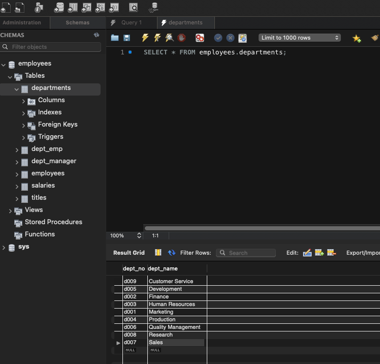
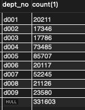

# MySQL

[toc]

参考以左耳朵的MySQL路线来学习下

## 官方文档（8.0版本）

### 0 Data Prepare

https://dev.mysql.com/doc/employee/en/employees-installation.html

### 1 General Infomation

MySQL的基本情况，历史，特点；8.0版本的新特性

#### 1.0 官方定位

- vary fast
- 多线程
- 多用户
- 鲁棒

一些特点

- GNU license
- 双重许可，可以根据GNU的条款用作开源产品，也可以从Oracle购买商业许可

#### 1.1 About This Manual

针对8.0版本，不兼容之前的。

不提供sql指导或关系数据库概念。

各种文档获取方式，以及最新文档地址等。

### 2 Installing and Upgrading MySQL

安装和后续的配置；老版本的升级

#### 2.4 Installing MySQL on macOS

- check系统版本
- 下载社区版本https://dev.mysql.com/downloads/mysql/
- 安装数据库
  - root/hellow0rld
- 在系统偏好配置中，双击MySQL图标，然后启动数据库，并勾选随机启动

### 3 Tutorial

基本使用教程

### 4 MySQL Programs

MySQL的一些程序，比如mysqld；环境参数等

### 5 MySQL Server Administration

MySQL服务器管理

### 6 Security

安全：常规，权限控制，加密连接，插件，企业级

### 7 Backup and Recovery

### 8 Optimization

优化sql表达式，索引，数据库结构，InnoDB表，执行计划，性能衡量

#### 8.0 案例

##### 1 order by [date] desc

- 描述
  - order by的条件是单独索引，且是时间类型的，区分度最大
  - where里面有大量的筛选条件
  - where里面的筛选条件不包含order by 的
  - where筛选条件里面有些条件有区分度较大的索引
- 现象是
  - 实际查出来的行数只有179行
  - 实际耗时160s左右
  - explain后发现，走的是order by条件的索引，extra中是using where，rows是3w左右
- 怀疑
  - order by 时间导致的？
  - order by的索引没有在where里面？
  - 数据量太大？
  - 其他sql拖慢整个库？
- 实验
  - order by 字段2 desc，explain发现走了where中的区分度最大的索引，using filesort,using where，rows大概7w，实际执行时间大概2s
  - order by 主键 的desc，因为主键和时间正相关，所以可以这么用。情况和上述实验类似，执行时间更快一些
- 疑问
  - order by 索引与否的区别？
  - explain中rows和实际的差距？
  - 初始情况为啥那么慢？？

下面一个个看

- order by 和索引的关系

  参考官方文档的来：https://dev.mysql.com/doc/refman/5.7/en/order-by-optimization.html#order-by-index-use

  建议是使用索引来加速排序这个动作，而且这个索引理论上是组合与否都可以的。

  另外，根据https://www.cnblogs.com/zhaoyl/archive/2012/05/04/2483513.html order by的字段不在where条件但在select中的时候是有排序操作的；

  所以原始的order by 索引字段的情况，是对排序操作有一定的加速作用的

- explain中rows和实际的差距？

  - 官方说了，这个是tm的估计值，是MySQL认为一定会检查的行数https://dev.mysql.com/doc/refman/5.7/en/explain-output.html#explain_rows

- 初始情况为啥那么慢？？

  其实应该分成几个子问题

  - 索引为什么选用了order by 的索引字段？
    - 读题：区分度最大
    - 所以where和order是一起看的，只是order是在where执行之后的
  - 选用这个索引字段会发生什么
    - 按照一系列where条件去过滤数据，而且没有索引字段的筛选，很慢；
    - 筛选后按照索引字段进行排序，很快
  - 为什么换一下order by的字段会比较快
    - 因为总体数据结果量比较小，所以排序影响其实不大，但order by 主键的话，应该会更好

- 最优改动方案

  - 新建一个索引，使用where中大区分度字段和order by 字段结合

  - 如果结果数据量预估都比较小，可以order by 主键 来解决，改动最小

- 关键点

  - order by 和where一起筛选索引字段
  - order by 和where的执行顺序
  - 索引对order by 的优化
  - rows的估算

后续发现使用id不是最好的方案，因为某些情况下，优化器认为id的区分度最大，然后还是全表扫描；

不如用left(date_time)的方式来，一方面保证了业务的正确性，一方面避免了走date_time索引全表扫描

#### 8.8 Understanding the Query Execution Plan

> The set of operations that the optimizer chooses to perform the most efficient query is called the “query execution plan”, also known as the EXPLAIN plan.

##### 8.8.1 Optimizing Queries with EXPLAIN

介绍了EXPLAIN语句的各种使用场景

- 适用于多种语句
- 看懂结果，从8.8.2的Format output来看
- 可以EXPLAIN connection
- 对于SELECT语句，可以有更多信息
- EXPLAIN 对于检查涉及分区表的查询非常有用。
- 多种输出格式

优化器（optimizer）的tracing，有时候是EXPLAIN结果的有效补充。

另外对于分析结果有异议的话，比如认为应该走某个索引但没有走的，可以使用ANALYZE语句重新对表格分析统计（TODO）；

##### 8.8.2 EXPLAIN Output Format

> EXPLAIN returns a row of information for each table used in the SELECT statement. It lists the tables in the output in the order that MySQL would read them while processing the statement. This means that MySQL reads a row from the first table, then finds a matching row in the second table, and then in the third table, and so on. When all tables are processed, MySQL outputs the selected columns and backtracks through the table list until a table is found for which there are more matching rows. The next row is read from this table and the process continues with the next table.

也就是说，EXPLAIN的结果，是按照MySQL会读的顺序列出来的表；

**EXPLAIN Output Columns**

介绍执行计划输出的每一列的含义；其中的type和EXTRA会有单独的部分介绍的；

> Each output row from EXPLAIN provides information about one table.

执行计划输出的每一行，是每个table的信息。


- id SELECT的标识符。是query语句中SELECT的序号

- select_type SELECT的类型

- table 是哪个table的信息，除了正常的表格，有可能是derived（衍生的，派生的）、union、subquery

- partitions 

  > The partitions from which records would be matched by the query.

- type 联接类型；前面这个是官方的名称join type的翻译，但实际上并不是多个表查询才是连接，更确切的是一种数据库引擎查找表的一种方式，称之为访问类型更好。

- possible_keys 可能走的索引

- key MySQL实际使用的索引，有可能不是possible_keys的其中之一

- key_len 

- ref 

  > The ref column shows which columns or constants are compared to the index named in the key column to select rows from the table.
  > If the value is func, the value used is the result of some function. To see which function, use SHOW WARNINGS following EXPLAIN to see the extended EXPLAIN output. The function might actually be an operator such as an arithmetic operator.

- rows MySQL认为一定要扫描的行数，innodb的话，是个估计值

- filtered 估计的筛选的百分比。参与join的行数，一般认为是rows*filtered。100%的话就是没有筛选。

- Extra 额外信息。

综合来看，select_type、key、rows可以直观看出查询的情况。type和EXTRA信息比较重要，可以反映出更多细节，单独篇章分析。

**EXPLAIN Join Types**

有以下几种，且按照由最优到最差的顺序排列：

- system 

  > The table has only one row (= system table). This is a special case of the const join type.

- const 唯一匹配情况

  通常是PRIMARY KEY 或UNIQUE KEY和常数的匹配情况。

  ```mysql
  SELECT * FROM tbl_name WHERE primary_key=1;
  
  SELECT * FROM tbl_name
  WHERE primary_key_part1=1 AND primary_key_part2=2;
  ```

- eq_ref 

  我的理解应该是多张表的情况，每个表的数据是一行一行映照着比对的。其中的eq表示条件是=，然后对索引的要求也是唯一键或主键，要全部使用才行。=的可以是常数也可以是表达式（expression）

  ```mysql
  SELECT * FROM ref_table,other_table
  WHERE ref_table.key_column=other_table.column;
  
  SELECT * FROM ref_table,other_table
  WHERE ref_table.key_column_part1=other_table.column
  AND ref_table.key_column_part2=1;
  ```

- ref

  同上，多张表的行行匹配。然后索引的最左被使用到就行，也是范围的情况的type。理论上就是这种类型，通过索引只能查到一个范围，不能像eq那种直接定位到一行具体数据。

  ```mysql
  SELECT * FROM ref_table WHERE key_column=expr;
  
  SELECT * FROM ref_table,other_table
  WHERE ref_table.key_column=other_table.column;
  
  SELECT * FROM ref_table,other_table
  WHERE ref_table.key_column_part1=other_table.column
  AND ref_table.key_column_part2=1;
  ```

- fulltext

  使用了FULLTEXT索引类型的。

- ref_or_null

  ref基础上，条件中有null类型的判断

  > This join type is like ref, but with the addition that MySQL does an extra search for rows that contain NULL values.

  ```mysql
  SELECT * FROM ref_table
  WHERE key_column=expr OR key_column IS NULL;
  ```

- index_merge

  说是多个索引会被使用到，从官方文档暂时没看懂..

  https://www.cnblogs.com/digdeep/archive/2015/11/18/4975977.html

  大概是多个索引扫描并合并结果进行使用，是MySQL5.0之后的能力。

  更多信息在8.2.1.3部分阐述。

- unique_subquery

  > This type replaces eq_ref for some IN subqueries of the following form:
  >
  > ```mysql
  > value IN (SELECT primary_key FROM single_table WHERE some_expr)
  > ```
  >
  > unique_subquery is just an index lookup function that replaces the subquery completely for better efficiency.

  充分替换子查询，以提高查询效率的；

- index_subquery

  类似上述，只是不是唯一索引的；

- range

  使用了索引，但只是检索出了一个范围的情况。ref这个时候是NULL。

  各种单表查询情况应该都可能出现

  ```mysql
  SELECT * FROM tbl_name
  WHERE key_column = 10;
  
  SELECT * FROM tbl_name
  WHERE key_column BETWEEN 10 and 20;
  
  SELECT * FROM tbl_name
  WHERE key_column IN (10,20,30);
  
  SELECT * FROM tbl_name
  WHERE key_part1 = 10 AND key_part2 IN (10,20,30);
  ```

- index

  类似ALL情况，只是索引树是被扫描了的。

  有两种情况，一种是索引完全覆盖了查询所需，这是EXTRA会显示Using index；另一种是没有覆盖，需要回表的。

- ALL

  全表扫描。

  如果表是第一个未标记为 const 的表，以及其他各种情况，通常不好。

  请使用索引加速。

**EXPLAIN Extra Information**

MySQL解决查询的额外信息。如果想持续优化查询，持续关注Using filesort和Using temporary

情况非常多，具体碰到之后再研究吧..

**EXPLAIN Output Interpretation**

以一个具体case来阐述如何使用执行计划。

##### 8.8.3 Extended EXPLAIN Output Format

##### 8.8.4 Obtaining Execution Plan Information for a Named Connection

##### 8.8.5 Estimating Query Performance

### 9 Language Structure

语言结构（？）

### 10 Character Sets，Collations，Unicode

字符集相关

#### 10.1 Character Sets and Collations in General

使用一个例子，A,B,a,b的编码和比较，来通俗的解释了什么是字符集，什么是Collation；

> Suppose that we have an alphabet with four letters: A, B, a, b. We give each letter a number: A = 0, B = 1,
> a = 2, b = 3. The letter A is a symbol, the number 0 is the encoding for A, and the combination of all four
> letters and their encodings is a character set.
> Suppose that we want to compare two string values, A and B. The simplest way to do this is to look at the
> encodings: 0 for A and 1 for B. Because 0 is less than 1, we say A is less than B. What we've just done is
> apply a collation to our character set. The collation is a set of rules (only one rule in this case): “compare
> the encodings.” We call this simplest of all possible collations a binary collation.

总结MySQL的字符集有几个特点：

- 可以用不同字符集存储字符串
- 用不同的规则集来比较字符串
- 在同一个服务器，同一个数据库，甚至是同一个表，都可以有不同的字符集设定
- 在任何级别启用字符集和排序规则的规范。

#### 10.2 Character Sets and Collations in MySQL

讲述了关于字符集和排序规则，在MySQL中的情况；

通过show character set [like ''];查看字符集；

通过SHOW COLLATION WHERE Charset = 'utf8mb4';查看排列规则；

排序规则有以下几点特性

- 每种字符集有默认的collation；
- 不同的字符集，不可能有相同的collation
- collation的命名有规则，一般是以对应的character set开头，然后跟1个或多个collation特性的描述，比如utf8mb4_general_ci；特性的具体，参考[10.3.1 Collation Naming Conventions](#####10.3.1 Collation Naming Conventions)

> mysql4.1及其之后的版本，对字符集的支持分为四个层次:
>
> 服务器(server)，数据库(database)，数据表(table)和连接(connection)：character_set_server：这是设置服务器使用的字符集
>
> character_set_client ：这是设置客户端发送查询使用的字符集
>
> character_set_connection ：这是设置服务器需要将收到的查询串转换成的字符集
>
> character_set_results ：这是设置服务器要将结果数据转换到的字符集，转换后才发送给客户端
>
> 可以通过下面的SQL语句来查看这4个值SHOW VARIABLES LIKE '%character_set%';

##### 10.2.1 Character Set Repertoire

##### 10.2.2 UTF-8 for Metadata

#### 10.3 Specifying Character Sets and Collations

默认的字符集和排序规则，可能不符合使用需要，可以指定四个维度（server, database, table, and column.）的设定。

##### 10.3.1 Collation Naming Conventions

排序规则的命名约定，有以下几个

1. collation的命名，一般是其关联的字符集打头，关联几个排序规则特性，比如utf8mb4_0900_ai_ci；特殊一点的是binary字符集对应的排序规则也叫binary；

2. 和语言相关的排序规则，命名中包含地理信息或语言名称，比如

   > For example, utf8mb4_tr_0900_ai_ci and utf8mb4_hu_0900_ai_ci sort characters for the utf8mb4 character set using the rules of Turkish and Hungarian, respectively.

3. 排序规则命名中的后缀，指明该排序规则是否：大小写敏感，重音敏感，片假名敏感，二进制；具体如下表

   | Suffix | Meaning            |
   | ------ | ------------------ |
   | _ai    | accent insensitive |
   | _as    | accent sensitive   |
   | _ci    | case insensitive   |
   | _cs    | case sensitive     |
   | _ks    | Kana-sensitive     |
   | _bin   | binary             |

   还有几点特殊说明：

   - 对于没有显式声明accent-sensitive的，跟着case-sensitive来走；

   - binary和_bin两种排序规则，是不同的：

     > For the binary collation of the binary character set, comparisons are based on numeric byte values. 
     >
     > For the _bin collation of a nonbinary character set, comparisons are based on numeric character code values, which differ from byte values for multibyte characters

4. Unicode字符集相关的collation，会在命名中标识其基于的算法（UCA）版本，默认是4.0.0；比如：utf8mb4_0900_ai_ci is based on UCA 9.0.0 weight keys

5. _general类型的，好像是兼容之前版本的MySQL的，没仔细搞懂这个。

### 11 Data Types

数据类型

### 12 Functions and Operators

#### 12.1 Built-In Function and Operator Reference

内嵌或称之为本地的函数和操作符

##### IFNULL(expr1,expr2)

> If expr1 is not NULL, IFNULL() returns expr1; otherwise it returns expr2.
>
> ```mysql
> mysql> SELECT IFNULL(1,0);
> -> 1
> mysql> SELECT IFNULL(NULL,10);
> -> 10
> mysql> SELECT IFNULL(1/0,10);
> -> 10
> mysql> SELECT IFNULL(1/0,'yes');
> -> 'yes'
> ```

使用上比较有意思，比如https://blog.csdn.net/weixin_38750084/article/details/83034248

```mysql
select IFNULL(mobile_phone,home_phone) phone 
from employee
```

据说是最好不要用在where中，性能不好，不过一般用的也是is not null这种；

##### REPLACE(str,from_str,to_str)

> Returns the string str with all occurrences of the string from_str replaced by the string to_str.
> REPLACE() performs a case-sensitive match when searching for from_str.
>
> ```mysql
> mysql> SELECT REPLACE('www.mysql.com', 'w', 'Ww');
> -> 'WwWwWw.mysql.com'
> ```
>
> This function is multibyte safe.

注意：

- 大小写敏感
- 多字节安全（由于字符集的表示，有可能使用多个字节表示一个字符，比如表情，导致的解析问题，待补充）

实际使用中，比如结合update语句，更新某种条件下的某个字段中的所有出现的a为b

```mysql
Update `table_name` SET `field_name` = replace (`field_name`,’from_str’,'to_str’) Where `field_name` LIKE ‘%from_str%’
```

#### 12.2 Loadable Function Reference

#### 12.4 Operators

##### 12.4.2 Comparison Functions and Operators

- expr BETWEEN min AND max

  双闭；

  和符号<= >=等同；

> If expr is greater than or equal to min and expr is less than or equal to max, BETWEEN returns 1,
> otherwise it returns 0. This is equivalent to the expression (min <= expr AND expr <= max) if
> all the arguments are of the same type

```mysql
mysql> SELECT 2 BETWEEN 1 AND 3, 2 BETWEEN 3 and 1;
-> 1, 0
mysql> SELECT 1 BETWEEN 2 AND 3;
-> 0
mysql> SELECT 'b' BETWEEN 'a' AND 'c';
-> 1
mysql> SELECT 2 BETWEEN 2 AND '3';
-> 1
mysql> SELECT 2 BETWEEN 2 AND 'x-3';
-> 0
```

​		注意不同的日期的数据类型的between比较，比较好的是使用CAST()操作为同一种类型；

> For best results when using BETWEEN with date or time values, use CAST() to explicitly convert the
> values to the desired data type. Examples: If you compare a DATETIME to two DATE values, convert the
> DATE values to DATETIME values. If you use a string constant such as '2001-1-1' in a comparison to
> a DATE, cast the string to a DATE.

- expr NOT BETWEEN min AND max

  > This is the same as NOT (expr BETWEEN min AND max).

  between的取反，但注意两端；就是[a,b]和(-oo,a)(b,+oo)的情况；

#### 12.7 Date and Time Functions

##### now()

https://dev.mysql.com/doc/refman/5.7/en/date-and-time-functions.html#function_now

> Returns the current date and time as a value in `'*`YYYY-MM-DD hh:mm:ss`*'` or *`YYYYMMDDhhmmss`* format, depending on whether the function is used in string or numeric context. The value is expressed in the session time zone.

也就是根据类型要求，返回两种不同的格式。

遇到过时间字段是bigint的，然后插入的时候是插入的now()，结果就是*`YYYYMMDDhhmmss`* 的样子。

后续的说明主要是和函数 [`SYSDATE()`](https://dev.mysql.com/doc/refman/5.7/en/date-and-time-functions.html#function_sysdate)的差异点比较，主要有两点

1. NOW()返回的是一个常量，是声明开始执行时间点的；sysdate()返回的是准确的时间点的时间；for example

   ```mysql
   mysql> SELECT NOW(), SLEEP(2), NOW();
   +---------------------+----------+---------------------+
   | NOW()               | SLEEP(2) | NOW()               |
   +---------------------+----------+---------------------+
   | 2006-04-12 13:47:36 |        0 | 2006-04-12 13:47:36 |
   +---------------------+----------+---------------------+
   
   mysql> SELECT SYSDATE(), SLEEP(2), SYSDATE();
   +---------------------+----------+---------------------+
   | SYSDATE()           | SLEEP(2) | SYSDATE()           |
   +---------------------+----------+---------------------+
   | 2006-04-12 13:47:44 |        0 | 2006-04-12 13:47:46 |
   +---------------------+----------+---------------------+
   ```

2. set timestamp会改变now()的值，不会影响sysdate()；设为0后会恢复

#### 12.8 String Functions and Operators

##### 12.8.1 String Comparison Functions and Operators

暂时仅关注其中对反斜线转义的描述：

> Note
> MySQL uses C escape syntax in strings (for example, \n to represent the
> newline character). If you want a LIKE string to contain a literal \, you must
> double it. (Unless the NO_BACKSLASH_ESCAPES SQL mode is enabled, in which
> case no escape character is used.) For example, to search for \n, specify it as
> \\\n. To search for \, specify it as \\\\\\\; this is because the backslashes are
> stripped once by the parser and again when the pattern match is made, leaving a
> single backslash to be matched against.

### 13 SQL Statements

表达式

#### 13.2 Data Manipulation Statements

##### 13.2.6 INSERT Statement

###### 13.2.6.2 INSERT ... ON DUPLICATE KEY UPDATE Statement

on duplicate key update是个固定用法的东西；针对插入时，主键或者唯一键值重复的情况，执行update内容

> If you specify an ON DUPLICATE KEY UPDATE clause and a row to be inserted would cause a duplicate value in a UNIQUE index or PRIMARY KEY, an UPDATE of the old row occurs.

以下语句功能一致

```mysql
INSERT INTO t1 (a,b,c) VALUES (1,2,3) ON DUPLICATE KEY UPDATE c=c+1;

UPDATE t1 SET c=c+1 WHERE a=1;
```

需要注意的是，不要对有可能插入语句的多个key对应的主键或唯一键值重复的情况

> If column b is also unique, the INSERT is equivalent to this UPDATE statement instead:
>
> UPDATE t1 SET c=c+1 WHERE a=1 OR b=2 LIMIT 1;
>
> If a=1 OR b=2 matches several rows, only one row is updated. In general, you should try to avoid using an ON DUPLICATE KEY UPDATE clause on tables with multiple unique indexes.

另外可以比较动态的使用更新能力，比如希望重复的时候，更新c为a字段和b字段之和的情况

```mysql
INSERT INTO t1 (a,b,c) VALUES (1,2,3),(4,5,6)
ON DUPLICATE KEY UPDATE c=VALUES(a)+VALUES(b);
```

8.0.20版本之后不建议这么使用，换为alias方式调用

```mysql
INSERT INTO t1 (a,b,c) VALUES (1,2,3),(4,5,6) AS new
ON DUPLICATE KEY UPDATE c = new.a+new.b;

INSERT INTO t1 (a,b,c) VALUES (1,2,3),(4,5,6) AS new(m,n,p)
ON DUPLICATE KEY UPDATE c = m+n;
```


更复杂的用法是insert的内容是通过select语句找到的内容，这个后续再研究。

##### 13.2.9 REPLACE Statement

replace表达式类似insert，只是需要定位后删除原行，插入新行；

所以replace必须用在有主键或唯一键的情况下；

是MySQL对SQL的拓展。

> REPLACE works exactly like INSERT, except that if an old row in the table has the same value as a new
> row for a PRIMARY KEY or a UNIQUE index, the old row is deleted before the new row is inserted. See
> Section 13.2.6, “INSERT Statement”.
>
> Note
> REPLACE makes sense only if a table has a PRIMARY KEY or UNIQUE index.
> Otherwise, it becomes equivalent to INSERT, because there is no index to be used to determine whether a new row duplicates another.

另外，不要把replace语句和replace函数搞混了。

##### 13.2.10 SELECT Statement

###### **关于order by**

- 针对每一个字段进行排序的；

  ```mysql
  order by a,b desc;
  意味着先按照a的升序，再对重复的按照b的降序排列
  ```

  

###### **关于distinct**

文档是和ALL关键词一起说的，这两个都是修饰词（modifier）；

distinct可以让结果集不重复；

单一字段的结果集好理解，但是对于多个字段情况，实际上返回的是组合不重复的情况；

> The ALL and DISTINCT modifiers specify whether duplicate rows should be returned. ALL (the default) specifies that all matching rows should be returned, including duplicates. DISTINCT specifies removal of duplicate rows from the result set. It is an error to specify both modifiers. DISTINCTROW is a synonym for DISTINCT.
> In MySQL 8.0.12 and later, DISTINCT can be used with a query that also uses WITH ROLLUP. (Bug #87450, Bug #26640100)

###### 13.2.10.2 JOIN Clause

2022-05-05 补充一个基本使用点，join on 多个条件，其实就是用and连接，但是之前很少这样去用。

```mysql
join on a.id = b.id and a.id = 3
```


join首先分为内连接和外连接；

- 内连接表示查询结果只返回符合连接条件的记录；
- 外连接则不同，表示查询结果返回某一个表中的所有记录，以及另一个表中满足连接条件的记录。
- MySQL中，INNER JOIN，JOIN，CROSS JOIN都是内连接，没区别；在SQL中则是有区别的；
- OUTER JOIN 分为LEFT JOIN和RIGHT JOIN，左右分别表示返回左表或右表的所有数据；

关于join有个重要问题是语句的性能怎么保证？综合目前了解到的（https://time.geekbang.org/column/article/79700，https://time.geekbang.org/column/article/80147），综合考虑下列两点

1. 驱动表选择
2. 算法选择

关于驱动表，首先因为是join，所以多张表中，总有一张会被选为驱动表，从这张表的数据遍历，去其他表中查询所需结果；

先给出结论：**选用小表做驱动表；且最好是可以用上被驱动表的索引的。**

这里的小表是

> 在决定哪个表做驱动表的时候，应该是两个表按照各自的条件过滤，过滤完成之后，计算参与 join 的各个字段的总数据量，数据量小的那个表，就是“小表”，应该作为驱动表。

具体原因，需要分情况讨论：

一种是可以走索引，我们称之为“Index Nested-Loop Join”，简称 NLJ；那么

> 在这个 join 语句执行过程中，驱动表是走全表扫描，而被驱动表是走树搜索。
>
> 假设被驱动表的行数是 M。每次在被驱动表查一行数据，要先搜索索引 a，再搜索主键索引。每次搜索一棵树近似复杂度是以 2 为底的 M 的对数，记为 log2M，所以在被驱动表上查一行的时间复杂度是 2*log2M。假设驱动表的行数是 N，执行过程就要扫描驱动表 N 行，然后对于每一行，到被驱动表上匹配一次。因此整个执行过程，近似复杂度是 N + N*2*log2M。
>
> 显然，N 对扫描行数的影响更大，因此应该让小表来做驱动表。

另一种是被驱动表用不上索引的情况；从最糟糕的Simple Nested-Loop Join算法（即直接遍历驱动表，然后遍历被驱动表），演进到Block Nested-Loop Join算法，优点在于将驱动表分段的载入内存中进行匹配，速度快很多；

在这种情况下，

> 假设，驱动表的数据行数是 N，需要分 K 段才能完成算法流程，被驱动表的数据行数是 M。注意，这里的 K 不是常数，N 越大 K 就会越大，因此把 K 表示为λ*N，显然λ的取值范围是 (0,1)。*
>
> *所以，在这个算法的执行过程中：
>
> *扫描行数是 N+λ*N*M；*
>
> *内存判断 N*M 次。
>
> 显然，内存判断次数是不受选择哪个表作为驱动表影响的。而考虑到扫描行数，在 M 和 N 大小确定的情况下，N 小一些，整个算式的结果会更小。
>
> 所以结论是，应该让小表当驱动表。

当然，NLJ(Index Nested-Loop Join)和BNL(Block Nested-Loop Join)这两个算法也是有优化空间的；

整体的思路是把原来算法中，一条一条去匹配的情况，往批量匹配的情况上靠，使用的手段是B+树的顺序读取的高性能+临时缓存的能力；具体参考上面的链接；

> 在这些优化方法中：
>
> 1. BKA 优化是 MySQL 已经内置支持的，建议你默认使用；
> 2. BNL 算法效率低，建议你都尽量转成 BKA 算法。优化的方向就是给被驱动表的关联字段加上索引；
> 3. 基于临时表的改进方案，对于能够提前过滤出小数据的 join 语句来说，效果还是很好的；
> 4. MySQL 目前的版本还不支持 hash join，但你可以配合应用端自己模拟出来，理论上效果要好于临时表的方案。

##### 13.2.11 Subqueries

子查询，定义是在另一个声明中的select语句；

主要优点有：

- 使语句结构化，也就是说可以隔离不同的查询；也是SQL的structured的来源；
- 是复杂的join和union的替代用法；
- 相比union和join，可读性更好；

官方给了一个示例，说明以上观点：

```sql
DELETE FROM t1
WHERE s11 > ANY
(SELECT COUNT(*) /* no hint */ FROM t2
WHERE NOT EXISTS
(SELECT * FROM t3
WHERE ROW(5*t2.s1,77)=
(SELECT 50,11*s1 FROM t4 UNION SELECT 50,77 FROM
(SELECT * FROM t5) AS t5)));
```

普通的select的东西，子查询都能用；另外，子查询可以用于外层是: SELECT, INSERT, UPDATE, DELETE, SET, or DO的情况下；

###### 13.2.11.10 Subquery Errors

有些子查询独有的错误：

- Unsupported subquery syntax

Message = "This version of MySQL doesn't yet support

版本不支持

- Incorrect number of columns from subquery

Message = "Operand should contain 1 column(s)"

类似：

```sql
SELECT (SELECT column1, column2 FROM t2) FROM t1;
```

子查询返回的，一般要求是单个，不管是列结果还是啥的，称为scalar
>A subquery can return a scalar (a single value), a single row, a single column, or a table (one or more rows
>of one or more columns). These are called scalar, column, row, and table subqueries.

- Incorrect number of rows from subquery:

Message = "Subquery returns more than 1 row"

类似：

```sql
SELECT * FROM t1 WHERE column1 = (SELECT column1 FROM t2);
```

- Incorrectly used table in subquery

Message = "You can't specify target table 'x' for update in FROM clause"

当尝试通过查询某张表的范围后，更新同一张表的时候出现，类似：

```sql
UPDATE t1 SET column2 = (SELECT MAX(column1) FROM t1);
```

可以通过common table expression(公用表？？)或派生表来解决；也就是说，把子查询的内容，select生成临时表，再执行update操作；详情参考[13.2.11.12 Restrictions on Subqueries](######13.2.11.12 Restrictions on Subqueries)

###### 13.2.11.12 Restrictions on Subqueries

1. 不能直接用于Update等，同一张表的情况

```sql
DELETE FROM t WHERE ... (SELECT ... FROM t ...);
UPDATE t ... WHERE col = (SELECT ... FROM t ...);
{INSERT|REPLACE} INTO t (SELECT ... FROM t ...);
```

但是有一种解决方法：如果对于修改后的表，您正在使用派生表并且该派生表已具体化而不是合并到外部查询中，则上述禁令不适用。

```sql
UPDATE t ... WHERE col = (SELECT * FROM (SELECT ... FROM t...) AS dt ...);
```

> Here the result from the derived table is materialized as a temporary table, so the relevant rows in t have already been selected by the time the update to t takes place.

#### 13.6 Compound Statement Syntax

##### 13.6.5 Flow Control Statements

###### 13.6.5.1 CASE Statement

case表达式，属于混合表达式-流程控制表达式分类；

有两种语法：

```sql
CASE case_value
WHEN when_value THEN statement_list
[WHEN when_value THEN statement_list] ...
[ELSE statement_list]
END CASE
Or:
CASE
WHEN search_condition THEN statement_list
[WHEN search_condition THEN statement_list] ...
[ELSE statement_list]
END CASE
```

第二种用过，比如update的时候给不同的where值设定不同的value；

第一种，是拿case的字段值和when值做比较，直观没想到使用场景；

举个例子如下

```sql
SELECT
    NAME '英雄',
    CASE NAME
        WHEN '德莱文' THEN
            '斧子'
        WHEN '德玛西亚-盖伦' THEN
            '大宝剑'
        WHEN '暗夜猎手-VN' THEN
            '弩'
        ELSE
            '无'
    END '装备'
FROM
    user_info;
```


##### 13.6.7 Condition Handling

###### 13.7.5.36 SHOW TABLE STATUS Statement

```sql
SHOW TABLE STATUS
[{FROM | IN} db_name]
[LIKE 'pattern' | WHERE expr]
```

table信息，尤其是看数据大小等、行数据大小

- [ ] 补充截图

部分字段说明：

- Rows：行数，Innodb不准确，甚至只是40-50%的样子，用count自己去查
- Data_length：Innodb下，是近似估计的已分配的空间大小。bytes。

猜测Innodb不准的原因，是Innodb存储的page导致的。

虽然是近似值，但也是可以做参考的。

#### 13.8 Utility Statements

效用表达式（？），DESCRIPTION,EXPLAIN,HELP,USE

##### 13.8.1 DESCRIBE Statement

是explain的同义词；

##### 13.8.2 EXPLAIN Statement

explain更多用于查看执行计划(that is, an explanation of how MySQL would execute a query).

desc是其他的，比如desc table_name

语法如下：

```sql
{EXPLAIN | DESCRIBE | DESC}
tbl_name [col_name | wild]
{EXPLAIN | DESCRIBE | DESC}
[explain_type]
{explainable_stmt | FOR CONNECTION connection_id}
{EXPLAIN | DESCRIBE | DESC} ANALYZE [FORMAT = TREE] select_statement
explain_type: {
FORMAT = format_name
}
format_name: {
TRADITIONAL
| JSON
| TREE
}
explainable_stmt: {
SELECT statement
| TABLE statement
| DELETE statement
| INSERT statement
| REPLACE statement
| UPDATE statement
}
```

###### Obtaining Table Structure Information

```sql
desc table_name;
```

###### Obtaining Execution Plan Information

explain

- 支持SELECT, DELETE, INSERT, REPLACE, and UPDATE语句，后续也会支持table语句
- > When EXPLAIN is used with an explainable statement, MySQL displays information from the optimizer
  > about the statement execution plan. That is, MySQL explains how it would process the statement,
  > including information about how tables are joined and in which order. For information about using
  > EXPLAIN to obtain execution plan information, see Section 8.8.2, “EXPLAIN Output Format”.

  具体学习看执行计划，要到8.8章节；

#### 13.7 Database Administration Statements

##### 13.7.7 SHOW Statements

###### 13.7.7.41 SHOW VARIABLES Statement

通过SHOW VARIABLES看MySQL的参数信息；

可以拼接LIKE使用；

```mysql
SHOW VARIABLES LIKE '%size%';
SHOW GLOBAL VARIABLES LIKE '%size%';
```

https://www.cnblogs.com/qlqwjy/p/8046592.html

### 14 MySQL Data Dictionary

### 15 The InnoDB Storage Engine

InnoDB存储引擎相关

### 16 Alternative Storage Engines

其他存储引擎

### 17 Replication

复制

### 18 Group Replication

### 19 MySQL Shell

### 20 Using MySQL as a Document Store

文件存储

### 21 InnoDB Cluster

### 22 InnoDB ReplicaSet

### 23 MySQL NDB Cluster 8.0

### 24 Partitioning

分片

### 25 Stored Objects

### 26 INFOMATION_SCHEMA Tables

#### 26.3 General Table Information

##### 26.3.25 The INFORMATION_SCHEMA TABLES Table

见[13.7.5.36 SHOW TABLE STATUS Statement](######13.7.5.36 SHOW TABLE STATUS Statement)

### 27 MySQL Performance Schema

### 28 MySQL sys schema

### 29 Connectors and APIs

### 30 MySQL Enterprise Edition

### 31 MySQL Workbench

https://dev.mysql.com/downloads/workbench/

### 32 MySQL on the OCI Marketplace

### FAQ

#### 1 USING BTREE 的索引是b树还是b+树

b+树；

只有b+和hash两种索引；

b和b+的区别在于数据是不是完全在叶子节点，和有无横向的指针（我认为比较关键的两点）

https://dev.mysql.com/doc/refman/5.7/en/create-index.html#create-index-options

官方说明中，索引类型就是叫BTREE，所以只能说底层是B+（引擎版本有关？）

### Error Messages and Common Problems

## 深入浅出MySQL（第2版）

### 第一部分 基础篇

### 第1章 MySQL的安装与配置

书里只介绍了Windows和Linux两种安装；我们找找Mac的

#### mac安装

[2.4 Installing MySQL on macOS](####2.4 Installing MySQL on macOS)

然后再下载workbench来获取一个图形化操作页面

[31 MySQL Workbench](###31 MySQL Workbench)

然后准备数据，以mysql官网提供的employee数据来导入先，参考

[0 Data Prepare](###0 Data Prepare)

#### 导入数据

1. 通过0下载文件到本地；
2. 打开benchmark，导入数据；
3. 出错，通过https://blog.csdn.net/qq_39812545/article/details/79934262修改绝对路径；
4. 再次尝试，完成导入；
5. 


### 第2章 SQL基础

目的：标准SQL的使用方法，以及一些拓展SQL的使用方法。

#### 2.1 历史及标准化

- 是使用关系模型的数据库应用语言
- ANSI标准，1970年代至今

#### 2.2 (My)SQL使用入门

(My)SQL这种命名，是为了介绍标准SQL之后，再介绍下MySQL对其的拓展。

##### 2.2.1 SQL分类

三类SQL语句

- DDL：Data **Definition** Languages，数据定义语言；定义各种数据库对象
  - 定义数据段，数据库，表，列，索引
  - 常用语句：create,drop,alter,rename
- DML：Data **Manipulation** Languages，数据操纵语言，操作数据库记录
  - 增删改查
  - 常用语句：insert,delete,update,select
- DCL：Data Control Languages，数据控制语言，控制数据段的访问和许可
  - 定义数据库、表、字段、用户的访问权限和安全级别
  - 常用语句：grant,revoke

##### 2.2.2 DDL语句

1. 创建数据库：create database dbname
2. 执行结果：3部分解读，Query OK, 1row affected (0.01 sec)
3. 删除数据库：drop database dbname；注意：**所有drop语句操作的结果都是显示“0 rows affected”**
4. 创建表：

```sql
CREATE TABLE tablename(
column_name_1 column_type_1 constrains,
  ...
 column_name_n column_type_n constrains
)
```

5. 查看表的定义

```sql
DESC tablename;
show create table tablename \G;
```

6. 删除表：drop table tablename
7. 修改表

```sql
---修改表字段
ALTER TABLE tablename MODIFY [COLUMN] column_definition [FIRST|AFTER col_name]; 
---增加表字段
ALTER TABLE tablename ADD [COLUMN] column_definition [FIRST|AFTER col_name]; 
---删除表字段
ALTER TABLE tablename DROP [COLUMN] col_name; 
---字段改名 
ALTER TABLE tablename CHANGE [COLUMN] old_col_name new_column_definition;
---表改名
ALTER TABLE tablename RENAME [TO] new_tablename;

--对同一张表的多个DDL可以合并为一条语句
ALTER TABLE a
DROP sth,
ADD COLUMN 'asdrt',
ADD INDEX idx_d(dfd);
```

##### 2.2.3 DML语句

对数据库中，表记录的操作，增删改查

###### 2.2.3.1 插入记录

```sql
INSERT INTO tablename(field1,field2...) VALUES(value1,value2...)
```

其中field是字段名，value是对应的值；

两个特殊规则

1. 可以只有value没有field，但顺序要和表的一致，且要全部字段对应的值都有

```sql
--官方数据集
insert into employees.departments values('d100','Test D');

--错误示范 Error Code: 1136. Column count doesn't match value count at row 1
insert into employees.departments values('Test D');
```

2. 可以指定部分field插入数据，未指定的字段要求必须是以下的一种或几种
   - 可空字段
   - 非空但有默认值的
   - 自增字段

还有一个很好的特性是，可以批量插入数据，节省大量网络开销

```sql
INSERT INTO tablename(field1,field2...)
VALUES
(record1_value1,record1_value2...),
(record2_value1,record2_value2...),
...
(recordn_value1,recordn_value2...);
```

###### 2.2.3.2 更新记录

```sql
UPDATE tablename SET field1=value1,field2=value2... [WHERE CONDITION]
```

更屌的是，可以同时更新多个表中数据

```sql
UPDATE t1,t2... SET t1.field1=expr1,tn.fieldn=exprn...[WHERE CONDITION]
```

据说，是多用于

> 根据一个表的字段来动态的更新另一个表的字段

- [ ] 找一个实际的update多个表的case

一条SQL语句更新一张表的多个字段：

```sql
update table_name
set column_name =
case
when "a" then "aa"
when "b" then "bb"
end,
column_name2 = 
when "a" then "a1"
when "b" then "b2"
end
where column_name3 in ("a","b");
```

通用语法，according to official doc

```sql
--Single-table syntax:
UPDATE [LOW_PRIORITY] [IGNORE] table_reference
SET assignment_list
[WHERE where_condition]
[ORDER BY ...]
[LIMIT row_count]
value:
{expr | DEFAULT}
assignment:
col_name = value
assignment_list:
assignment [, assignment] ...
--Multiple-table syntax:
UPDATE [LOW_PRIORITY] [IGNORE] table_references
SET assignment_list
[WHERE where_condition]
```

2022-05-05 补充 在update语句中，使用查询锁定范围的方式

参考https://wenku.baidu.com/view/0a68a31213661ed9ad51f01dc281e53a5802513b.html

主要用到的是join的能力

```mysql
update a inner join (select * from b) temp on temp.id = a.id 
set a.name = "shit"
where a.del_status = 1
```


###### 2.2.3.3 删除记录

和更新类似，也是基本的单表删除和多表删除

```sql
DELETE FROM tablename [WHERE CONDITION]

DELETE t1,t2,t3... FROM t1,t2,t3... [WHERE CONDITION] 
```

只是需要牢记，不加WHERE条件的话，会全量删除，GG

###### 2.2.3.4 查询记录

查询乃重中之重，但直接上代码和注释更直观，只是浏览的话，建议先看注释，想一想应该是什么，再去看命令语法

```sql
--全量查询
SELECT * FROM tablename [WHERE CONDITION]

--查询不重复
SELECT DISTINCT field1 FROM tablename [WHERE CONDITION]

--条件查询
--CONDITION部分，可以有各种比较运算符，也可以有逻辑运算符如and or

--排序和限制
SELECT * FROM tablename [WHERE CONDITION] [ORDER BY field1 [DESC/ASC], field2 [DESC/ASC]...] [LIMIT offset_start, row_count]
--默认是ASC
--多个字段排序，是按照先后顺序去排的，每个字段都可以拥有不同的排序顺序；若只有一个字段进行排序，遇到相同的记录，相同的记录将会无序排列
--如果只希望展示特定的部分的数据，可以使用limit
--offset_statr是偏移量，row_count是行数
--注意：limit是MySQL拓展SQL的语法，其他数据库可能不适用

--聚合
SELECT [field1,field2...] fun_name
FROM tablename
[WHERE CONDITION]
[GROUP BY field1,field2... [WITH ROLLUP]]
[HAVING HAVING_CONDITION]
--其中fun_name是要做的聚合操作，也就是聚合函数，常用的有sum,max,min,count
--with rollup是对分类聚合之后的结果再汇总
--比如说
SELECT dept_no,count(1) 
from employees.dept_emp 
group by dept_no with rollup;
--统计各部门员工总数，并汇总员工总数，结果如图

```



```sql
--HAVING关键字表示对分类后的结果再进行条件的过滤；
--having和where的区别在于，聚合前还是聚合后的过滤；尽量使用where，提高聚合的效率

--表连接
--大类上分为内连接和外连接；内连接仅选出两张表中互相匹配的记录，外连接会选出其他不匹配的记录
--外连接又细分为左连接和右连接；左或者右表示，选出左或者右表中不匹配的记录
select emp.emp_no,emp.dept_no from employees.dept_emp emp left join employees.departments dep on emp.dept_no = dep.dept_no;

select emp.emp_no,emp.dept_no from employees.dept_emp emp join employees.departments dep on emp.dept_no = dep.dept_no;

--子查询
select emp.emp_no from employees.employees emp where emp.emp_no in (select emp_no from employees.dept_emp)
--用于子查询的关键字主要包括in,not in,exists,not exists,=,!=
--在某些情况下，子查询可以转化为表连接，主要是两个方面的考虑：MySQL4.1之前不支持子查询，表连接在很多情况的性能是优于子查询的

--记录联合
--用于将两个表的数据按照一定条件查询之后，将结果合并显示的场景
select dept_no from employees.departments
union all
select dept_no from employees.dept_emp;
--union all是结果直接合并展示，union是去重之后的展示
```


## 遇到的问题些

### 1 插入表情时候java报错，SQLException，咋处理？

直接反应是去改对应表的字符集，utf8为utf8mb4；

alter table table_name character set 'utf8mb4';

然后验证发现失败...

疑惑了很久，使用了以下几种方式

- show variables like '%char%'查看当前数据库的字符设置，然后发现character_set_client和character_set_connection是utf8；怀疑这里有问题，尝试通过set names utf8mb4来改，发现不允许这个修改；
- 尝试调整java中jdbc的配置来，尝试后失败

经过咨询，通过show create table table_name ，发现每一字段都有Character set utf8描述，然后表的描述是character set utf8mb4；所以，应该是建表的时候，不只是指定了整张表的字符集，也指定了每一字段的字符集；

把字段的字符集调整后，问题得以解决；

alter table table_name change column_name column_name varchar(100) character set utf8mb4 collate utf8mb4_general_ci

根本原因是对mysql的字符集这块不熟悉，其实官方文档在字符集这块第一部分就描述了“在任何级别启用字符集和排序规则的规范。”[character general](####10.1 Character Sets and Collations in General)

### 2  MySQL 的转义

反斜线，MySQL uses C escape syntax in strings (for example, \n to represent the
newline character).


## 参考文献

1 


## TODO List

| 时间    | 内容                                                    |              |
| ------- | ------------------------------------------------------- | ------------ |
| 2021-10 | Mac安装MySQL                                            | 重要但不紧急 |
| 2021-10 | Linux安装MySQL                                          | 不重要不紧急 |
| 2021-10 | logs的MySQL问题开始处理                                 | 不重要但紧急 |
| 2021-11 | 官方文档和深入浅出MySQL一起结合着看                     |              |
| 2022-02 | ON DUPLICATE KEY UPDATE，insertOrUpdate<br />IFNULL函数 |              |


## 总结

| 时间 | 内容 |      |
| ---- | ---- | ---- |
|      |      |      |
|      |      |      |
|      |      |      |

