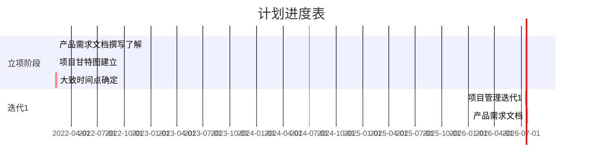

# 手工计划

[toc]

| 版本号 | 时间       | 主要内容       |
| ------ | ---------- | -------------- |
| 1.0    | 2022-02-07 | 立项和路线制定 |
|        |            |                |
|        |            |                |

## 项目总述

2022一年，以建立一个学习状况记录网站为自己的项目，来遇到问题、解决问题并自我迭代学习。

## 项目进度及问题跟踪

| 时间       | 角色     | 主要内容                 | 遗留或产生的问题              |
| ---------- | -------- | ------------------------ | ----------------------------- |
| 2022-02-07 | 产品经理 | 了解怎么撰写产品需求文档 | 初步了解，然后着手去搞迭代1的 |
|            | 项目管理 | 建立整个项目的甘特图     | 里程碑确立                    |
|            |          |                          |                               |

### 1 2022-02项目初期问题

#### 1.1 项目目标

- 建立网站，记录学习路线，网络，且能记录进度；
- 进阶情况能输出图文
- 登录
- 全网访问

#### 1.2 个人工作角色和工作量量评估

- 工作角色：项目管理、产品经理、后端开发、前端开发、测试、运维、运营
- 资源：328人/天
- 工作量评估（1.0）：
  - 项目管理：10人天
  - 产品经理：20人天
  - 后端开发：200人天
  - 前端开发：20人天
  - 测试：50人天
  - 运维：50人天
  - 运营：20人天

### 2 产品方案

#### 2.1 怎么撰写产品方案

初步了解：

参考：https://time.geekbang.org/column/article/7735 

> 并不是要“教条式”的向你传达如何做产品经理、如何写产品需求文档，更重要的目的是带给你一个新的思考方式，把可以借鉴的方法应用到你的实际工作中，相信会起到事半功倍的效果。
>
> 
>
> 这篇文章我和你分享了产品需求文档需要包含五大关键内容：解决的痛点问题是什么，论证这个痛点确实存在，说明如何衡量成功，要清晰描述场景，并解释清楚产品功能方案。
>
> 成功的产品需求文档，可以让团队成员都明确要解决的痛点以及解决的方式，让大家对产品从策略到执行都清清楚楚，从而实现团队成员之间的高效沟通。
>
> 另外，我还跟你分享了两个可能会踩的坑：一是，没有论证这个痛点到底是不是存在，而是想当然认为用户肯定有这个痛点；二是，没有提前考虑到产品可能出问题、实际执行影响预期功能计划的情况，导致产品发布时间推后。

所以，从头去提一个产品需求，可以先依照五个关键内容（解决的痛点问题是什么，论证这个痛点确实存在，说明如何衡量成功，要清晰描述场景，并解释清楚产品功能方案）去走；

具体描述如下

- 第一，要解决什么问题。

  让大家对产品要解决的用户痛点保持一致

- 第二，论证这个痛点问题到底是不是存在

- 第三，写清楚这个功能的成功指标和反指标是什么。

- 第四，讲清楚要解决的用户场景。

- 第五，解释清楚产品功能方案。

  1. 如何开启这个功能。
  2. 这个功能的流程图是什么样的，这是最重要的部分。
  3. 这个功能哪些部分可以使用已有的架构或者产品流，这样可以在已有基础上稍作修改，而不用重新开发，可以大大节约产品开发时间。  
  4. 如果涉及到和其他组合作时，我需要先和其他部门沟通好，方便我们组开展工作。
  5. 有些情况下这个功能可能无法达到预期效果，那么这时的解决方案是什么。
  6. 往往事先没有想清楚的地方都可能会出现问题，导致整个产品设计和开发都得从头来，这也是一个坑。

## 总结及反思

## 参考文献

1 

## TODO List

| 时间 | 内容 |      |
| ---- | ---- | ---- |
|      |      |      |
|      |      |      |
|      |      |      |

